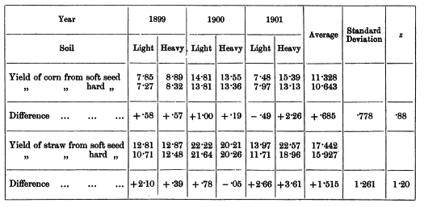
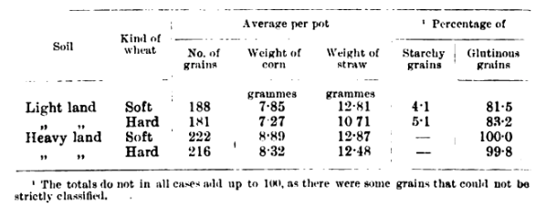
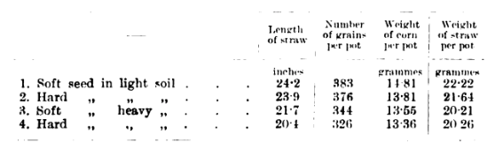
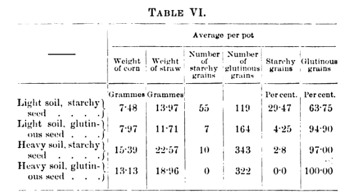

```{r setup, include=FALSE}
knitr::opts_chunk$set(echo = FALSE)
library(knitr)
library(reticulate)
library(tidyverse)
```

William Sealy Gosset, writing as _Student_, famously published _The Probable Error of a Mean_ in 1908 deriving the T-distribution and suggesting the T-test.

In revisiting the paper while preparing my lectures for this week I have noticed some discrepancies in the _Illustration II_ section. Seeking out the data sources used by Student, I could verify the data used and that the discrepancy is isolated to two arithmetic errors on behalf of Student.

### The Data

Illustration II uses data on growing soft and hard wheat in heavy and light soil and measuring straw and corn yields from the different factors over 3 years. Student gives us:



From the yield measurements by Voelcker, Student extracts differences and then computes mean difference, standard deviation of the difference, and his $z$ measure (that seems to be $\overline{x}/s$).

### The Source Data

Looking up (scanned copies of) the Journal of the Royal Agricultural Society, I could find the data tables where Student had sourced this data set spread of 3 volumes of the Journal:







We can verify the numbers as reported by Student in these tables from Voelcker, and could digitize the data set by copying all the numbers into a data frame or tibble:

```{r include=FALSE}
voelcker = tribble(
  ~year, ~soil, ~yieldtype, ~seedtype, ~yield,
  1899, "light", "corn", "soft", 7.85,
  1899, "heavy", "corn", "soft", 8.89,
  1900, "light", "corn", "soft", 14.81,
  1900, "heavy", "corn", "soft", 13.55,
  1901, "light", "corn", "soft", 7.48,
  1901, "heavy", "corn", "soft", 15.39,
#
  1899, "light", "corn", "hard", 7.27,
  1899, "heavy", "corn", "hard", 8.32,
  1900, "light", "corn", "hard", 13.81,
  1900, "heavy", "corn", "hard", 13.36,
  1901, "light", "corn", "hard", 7.97,
  1901, "heavy", "corn", "hard", 13.13,
#
  1899, "light", "straw", "soft", 12.81,
  1899, "heavy", "straw", "soft", 12.87,
  1900, "light", "straw", "soft", 22.22,
  1900, "heavy", "straw", "soft", 20.21,
  1901, "light", "straw", "soft", 13.97,
  1901, "heavy", "straw", "soft", 22.57,
#
  1899, "light", "straw", "hard", 10.71,
  1899, "heavy", "straw", "hard", 12.48,
  1900, "light", "straw", "hard", 21.64,
  1900, "heavy", "straw", "hard", 20.26,
  1901, "light", "straw", "hard", 11.71,
  1901, "heavy", "straw", "hard", 18.96,
)
voelcker_diff = voelcker %>% pivot_wider(names_from="seedtype", values_from="yield") %>% mutate(increase=soft-hard)

write_csv(voelcker, "voelcker.csv")
write_csv(voelcker_diff, "voelcker_diff.csv")
```

```{r}
kable(voelcker)
```

For your convenience, [here](voelcker.csv) is this table in a downloadable format, as well as [the differences](voelcker_diff.csv) that Student focuses on, both in CSV-format.

### The Issue

The discrepancy lies in the computation of the differences. Consider the _straw_ yields in _light_ soil in 1900 and 1901. Student states for us:

Year | Soft | Hard | Increase
-|-|-|-
1900 | 22.22 | 21.64 | 0.78
1901 | 13.97 | 11.71 | 2.66

But these subtractions are not accurate! 22.22-21.64=`r 22.22-21.64` and 13.97-11.71=`r 13.97-11.71`. These miscalculations then contribute to throwing off Student's subsequent computations.

```{r}
student.sd = function(x)
  mean(round((x-mean(x))^2, 3)) - round(mean((x-mean(x))), 3)^2

student_summaries = voelcker_diff %>% 
  group_by(yieldtype) %>%
  summarize(mean.soft.corn = mean(soft),
            mean.hard.corn = mean(hard),
            mean.increase = mean(increase),
            sd.increase = sd(increase),
            student.sd.increase = student.sd(increase))
student_summaries = student_summaries %>% 
  mutate(z = mean.increase/sd.increase,
         student.z = mean.increase/student.sd.increase)
```

Student also computes standard deviations as $\sqrt{\frac{1}{n}\sum(x_i-\overline{x})^2}$ and not $\sqrt{\frac{1}{n-1}\sum(x_i-\overline{x})^2}$, throwing the values off by a factor $\sqrt{\frac{n-1}{n}}=\sqrt{\frac{5}{6}}$.

Student reports:

Type | Soft Average | Hard Average | Increase Average | Increase Std Dev | $z$
-|-|-|-|-|-
Corn | 11.328 | 10.643 | 0.685 | 0.778 | 0.88
Straw | 17.442 | 15.927 | 1.515 | 1.261 | 1.20

A computation directly from the provided data instead yields, where the standard deviations and $z$-values following Student's definitions are also included:

```{r}
kable(student_summaries, col.names=c("Type", "Soft Average", "Hard Average", "Increase Average", "Increase Std Dev", "Increase Std Dev (Student)", "z", "z (Student)"))
```

I am unable to fully reconstruct Student's stated values, not just of summary statistics for the Straw yield type (where the computation of the differences is already erroneous) but for standard deviation and $z$-value for either type. Whether or not I use the formulas given in Student (1908) I still get different values for the standard deviation.


## Student's T-test

These resulting $z$-values (computed by Student to be 0.88 and 1.20; reconstructed to either 0.745, 1.05 or 0.972, 0.901) are then used in lookup tables compiled by Student. These lookup tables correspond to computing $CDF_{T(n-1)}(z\sqrt{n-1})$ - as can be seen by Student reporting the computed $p=0.9465$ for $z=0.88$ and $p=0.9782$ for $z=1.20$. A modern approach would instead compute $CDF_{T(n-1)}(z\sqrt{n})$. Student then uses these to compute odds $p/(1-p)$.

$z$ | $CDF_{T(n-1)}(z\sqrt{n-1})$ | Odds | $CDF_{T(n-1)}(z\sqrt{n})$ | Odds
-|-|-|-|-
0.88 | `r round(pt(0.88*sqrt(5), 5),4)` | `r round(pt(0.88*sqrt(5), 5)/(1-pt(0.88*sqrt(5), 5)), 1)` | `r round(pt(0.88*sqrt(6), 5),4)` | `r round(pt(0.88*sqrt(6), 5)/(1-pt(0.88*sqrt(6), 5)), 1)`
1.20 | `r round(pt(1.20*sqrt(5), 5),4)` | `r round(pt(1.20*sqrt(5), 5)/(1-pt(1.20*sqrt(5), 5)), 1)` | `r round(pt(1.20*sqrt(6), 5),4)` | `r round(pt(1.20*sqrt(6), 5)/(1-pt(1.20*sqrt(6), 5)), 1)`
0.745 | `r round(pt(0.745*sqrt(5), 5),4)` | `r round(pt(0.745*sqrt(5), 5)/(1-pt(0.745*sqrt(5), 5)), 1)` | `r round(pt(0.745*sqrt(6), 5),4)` | `r round(pt(0.745*sqrt(6), 5)/(1-pt(0.745*sqrt(6), 5)), 1)`
1.05 | `r round(pt(1.05*sqrt(5), 5),4)` | `r round(pt(1.05*sqrt(5), 5)/(1-pt(1.05*sqrt(5), 5)), 1)` | `r round(pt(1.05*sqrt(6), 5),4)` | `r round(pt(1.05*sqrt(6), 5)/(1-pt(1.05*sqrt(6), 5)), 1)`
0.972 | `r round(pt(0.972*sqrt(5), 5),4)` | `r round(pt(0.972*sqrt(5), 5)/(1-pt(0.972*sqrt(5), 5)), 1)` | `r round(pt(0.972*sqrt(6), 5),4)` | `r round(pt(0.972*sqrt(6), 5)/(1-pt(0.972*sqrt(6), 5)), 1)`
0.901 | `r round(pt(0.901*sqrt(5), 5),4)` | `r round(pt(0.901*sqrt(5), 5)/(1-pt(0.901*sqrt(5), 5)), 1)` | `r round(pt(0.901*sqrt(6), 5),4)` | `r round(pt(0.901*sqrt(6), 5)/(1-pt(0.901*sqrt(6), 5)), 1)`


## Bibliography

* Student, _The Probable Error of a Mean_, Biometrika (1908) [jstor](https://www.jstor.org/stable/pdf/2331554.pdf)
* Voelcker, _The Woburn Pot-culture Station_, Journal of the Royal Agricultural Society of England, Series 3, Volume 61 (1900) [hathitrust](https://babel.hathitrust.org/cgi/pt?id=mdp.39015073293782&view=1up&seq=620)
* Voelcker, _The Woburn Pot-culture Experiments_, Journal of the Royal Agricultural Society of England, Series 3, Volume 62 (1901) [hathitrust](https://babel.hathitrust.org/cgi/pt?id=mdp.39015073293774&view=1up&seq=348)
* Voelcker, _The Woburn Pot-culture Experiments, 1901_, Journal of the Royal Agricultural Society of England, Series 3, Volume 63 (1902) [hathitrust](https://babel.hathitrust.org/cgi/pt?id=hvd.32044089548291&view=1up&seq=396)

